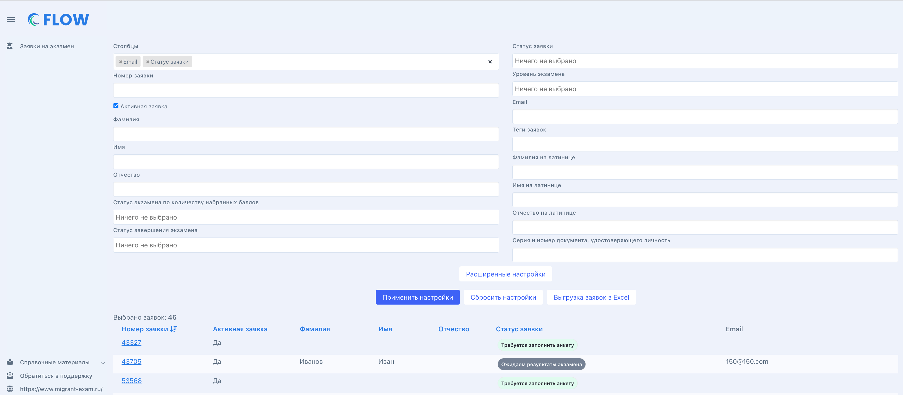

Во Flow для проверяющих доступен пункт "Заявки" - это большой настраиваемый список. Поле "Столбцы" позволит добавить необходимые столбцы в  таблицу с результатами. Результаты отобразятся по кнопке "Применить настройки".

"Расширенные фильтры" откроют больше полей для поиска и фильтрации заявок по выбранным критериям.

{width=3470px height=1520px}

Клик по номеру заявки откроет  страницу заявки, где можно будет посмотреть [документы и информацию по экзамену для конкретного человека](./dokumenty-i-informaciya-po-zayavke/_index)