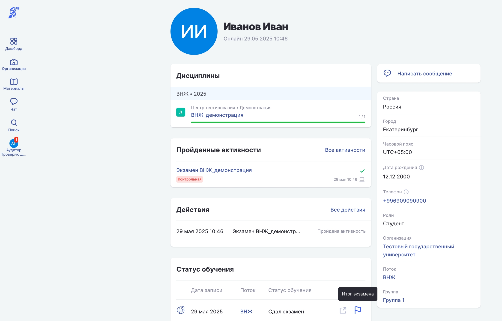
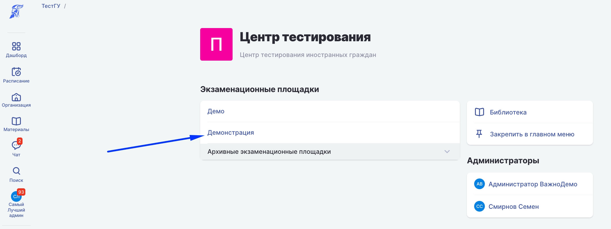
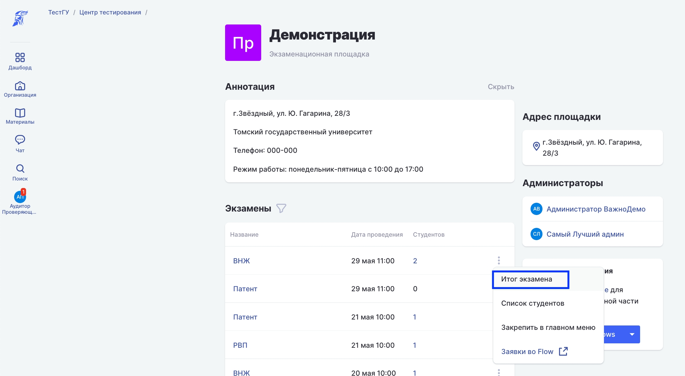
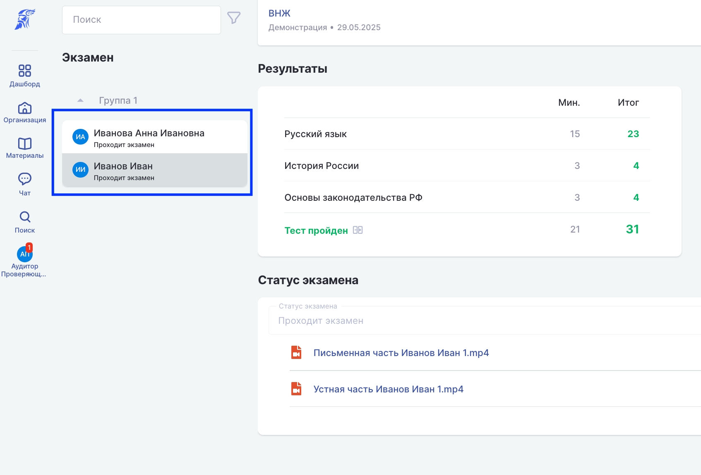
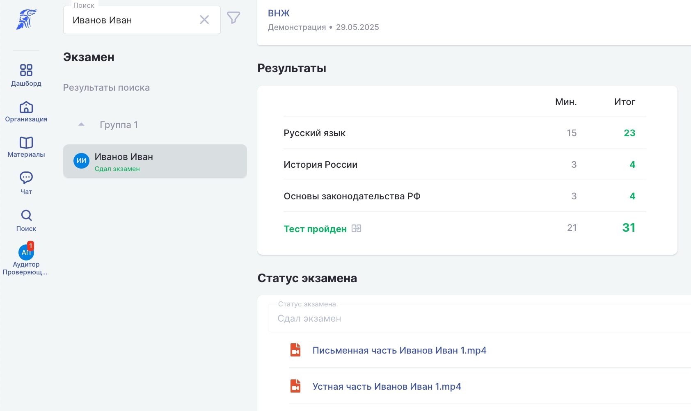

В Odin сдающий проходит тестирование и сдаёт устную часть (для экзаменов по РВП и ВНЖ). \
Обе части экзамена фиксируются в системе и сохраняются видео.

### **Как посмотреть результаты и видео сдающего экзамен?**

[tabs]

[tab:Со страницы сдающего]

Со страницы профиля сдающего нажать на флажок - итог экзамена

{width=2176px height=1396px}

[/tab]

[tab:Из списка экзаменов]

1\. Откройте страницу площадки, где требуется посмотреть экзамены

{width=2170px height=816px}

2\. В списке экзаменов, которые уже прошли, нажмите 3 точки и выберите пункт "Итог экзамена"

:::info 

Экзамены, которые прошли по дате и проверены сотрудниками центра тестирования, будут отмечены архивными. Каждый из архивных экзаменов доступен для просмотра

:::

{width=2182px height=1198px}

3\. Выбрать сдающего из списка и посмотреть его результаты и запись экзамена

{width=1694px height=1150px}

4\. Посмотреть видео и результаты

{width=1684px height=1002px}

[/tab]

[/tabs]